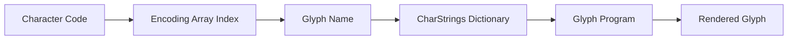
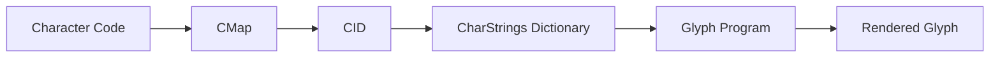
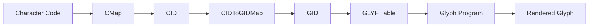

# PDF Font Optimization: Design Notes

> **Author:** Ken Sharp (with light editing)  
> **Topic:** CIDFont optimization for PDF text rendering  
> **Status:** Technical Implementation Guide

## Executive Summary

This document outlines a solution for optimizing PDF font embedding using a single-glyph font approach with CIDToGIDMap optimization.

## Proposed Solution

### Core Concept
- **Single Glyph Font**: Use a font containing only one glyph (`.notdef`)
- **CIDToGIDMap**: Map all Character IDs (CIDs) to 0
- **Storage**: Store the map as a compressed stream in the PDF file
- **Benefit**: Significantly reduced file size while maintaining functionality

### Technical Implementation

The CIDToGIDMap implementation is straightforward:

1. **Create Stream Object**: Contains 128KB of data (2 bytes per possible CID)
2. **CID Range**: Covers CIDs from 0 to 65535
3. **Mapping Change**: Replace `"/CIDToGIDMap /Identity"` with `"/CIDToGIDMap <object> 0 R"`

### Future Extensibility
> **Note**: If different CMap encodings are used for character codes in the future, the CIDToGIDMap can be easily extended to accommodate them. 
  
---

## Background: How PDF Font Rendering Works

> **Note**: This section provides foundational knowledge about PDF font mechanisms. Feel free to skip if you're already familiar with PDF internals.

### Original Purpose vs. Modern Requirements

**Original Design:**
- PDF fonts were initially designed solely for rendering
- Text extraction and copying were not primary concerns

**Modern Extensions:**
- Text location and copying capabilities have been retrofitted
- These features are now expected by users and applications

### ToUnicode CMap: The Key to Text Extraction

#### What is a ToUnicode CMap?
A **ToUnicode CMap** is a mapping device that converts character codes to Unicode code points, enabling reliable text extraction and copying.

#### How it Works:
- ✅ **With ToUnicode CMap**: Character codes → Unicode values (reliable)
- ❌ **Without ToUnicode CMap**: Reader falls back to heuristics (prone to failure)

#### PDF Specification Requirement:
> **Important**: According to PDF specification, a ToUnicode CMap cannot exist in isolation—it must be attached to a font. This means even for text rendering mode 3, a font definition is required for copy/paste functionality. 
  
### The Problem with Current Implementation

**Tool Compatibility Issues:**
- Tools like `pdfwrite` expect to modify font entries
- They require embedded fonts to be valid according to PDF standards
- Current Tesseract font embedding is not valid for this purpose

---

## Technical Deep Dive: PDF Text Rendering Pipeline

### Understanding Character Codes vs. Text

Consider this PDF text specification:
```pdf
(Test) Tj
```

**Important**: This is **not** actual text—each byte represents a **character code**.

### The Rendering Process

The conversion from character codes to rendered glyphs involves a complex multi-step pipeline:

```
Character Code → [Mapping Process] → Glyph → Rendered Text
```

> **Example**: Through character mappings, `(Test)` could actually render as `Sftu`

### Font Type 1 (PostScript) Pipeline



**Step-by-step Process:**
1. **Character Code** → **Index** into Encoding array (256 elements)
2. **Encoding Array** → **Glyph Name**
3. **Glyph Name** → **Key** for CharStrings dictionary lookup
4. **CharStrings Dictionary** → **Glyph Program** (describes how to draw the glyph) 
  
### CIDFonts: A More Complex Approach

#### Why CIDFonts?
CIDFonts handle large character sets more efficiently than simple fonts:
- **Problem**: Using glyph names as keys becomes unreasonable for large fonts
- **Problem**: Encoding arrays would become unfeasibly large
- **Solution**: Use numeric **Character IDs (CIDs)** instead

#### CIDFont Pipeline



**Key Differences:**
- **CMap** replaces the Encoding array (more compact and flexible)
- **CIDs** are simple numbers, not glyph names
- Same dictionary lookup process as Type 1 fonts

#### Variable-Width Character Codes

CMap also determines character code byte length:

| Byte Range | Character Code Length | Example Use Case |
|------------|----------------------|------------------|
| `0x00-0x7F` | 1 byte | ASCII characters |
| `0x80-0xF0` | 2 bytes | Extended characters |
| `0xF0-0xFF` | 3 bytes | Complex scripts |

> **Note**: CMaps can define character codes up to **5 bytes wide** for comprehensive language support. 
  
### TrueType CIDFonts: Adding Another Layer

#### The Additional Complexity
TrueType fonts require an extra mapping step because:
- **TrueType Access**: Uses **Glyph IDs (GIDs)** and LOCA table
- **Mismatch**: GIDs may not correspond to CIDs
- **Solution**: **CIDToGIDMap** bridges this gap

#### Complete TrueType CIDFont Pipeline



**Full Process:**
```
Character Code → CID → GID → Glyph Program
```

---

## Case Study: Current Implementation Issues

### Example from Supplied PDF File

**PDF Content:**
```pdf
<0x0075> Tj
```

**Processing Steps:**
1. **Character Code**: 117 (0x0075)
2. **CMap Lookup**: Identity-H (predefined) → Character Code 117 → CID 117 
3. **CIDToGIDMap Lookup**: Identity (predefined) → CID 117 → GID 117
4. **Problem**: Font only contains 116 glyphs, but needs to access GID 117

### The Challenge

#### For Latin Scripts
- **Manageable**: Supply a larger font with more glyphs
- **Feasible**: Extend glyph count to cover required range

#### For Complex Languages
- **Problematic**: Font size becomes impractical
- **Challenge**: Need glyphs for all possible CID→GID mappings

---

## Proposed Solutions

### Solution 1: TrueType CIDFont Optimization

**Approach:**
- Intervene at the **CIDToGIDMap** stage
- Map **all CIDs → GID 0**
- Use font with **single glyph**: `.notdef` at GID 0

**Benefits:**
- ✅ Minimal font size
- ✅ Handles any CID range
- ✅ Currently under development

### Solution 2: PostScript CIDFont Alternative

**Approach:**
- Use **PostScript (Type 1 outlines)** CIDFont
- Single glyph font
- CMap maps **all character codes → CID 0**

**Comparison:**
| Aspect | TrueType + CIDToGIDMap | PostScript + CMap |
|--------|------------------------|-------------------|
| **Effect** | Identical | Identical |
| **Size** | Unknown | Potentially smaller |
| **Complexity** | Medium | Medium |

> **Note**: Size comparison between PostScript CIDFont+CMap vs TrueType font+CIDToGIDMap needs verification. 
  
---

## Implementation Update

### Adobe Acrobat Compatibility Issue

**Problem Discovered:**
- Using **GID 0** causes Acrobat to complain about font extraction
- Error message: "Cannot extract the font"

**Workaround:**
- Set **CIDToGIDMap entries to 1** instead of 0
- Acrobat accepts this configuration without complaints

> **Developer Note**: This behavior seems arbitrary and illogical, but necessary for Adobe Acrobat compatibility.

---

## Summary

This document outlines a comprehensive approach to PDF font optimization through:

1. **Single-glyph fonts** for minimal size
2. **CIDToGIDMap manipulation** for universal compatibility
3. **Adobe Acrobat workarounds** for practical implementation

The solution addresses both technical requirements and real-world compatibility constraints while maintaining PDF specification compliance.

---

*End of document* 
